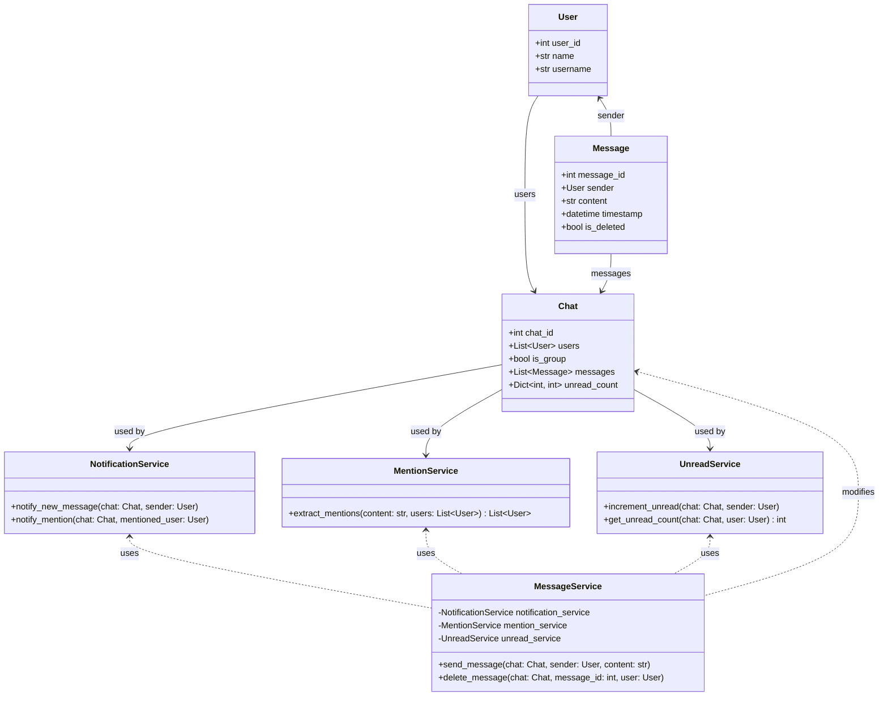
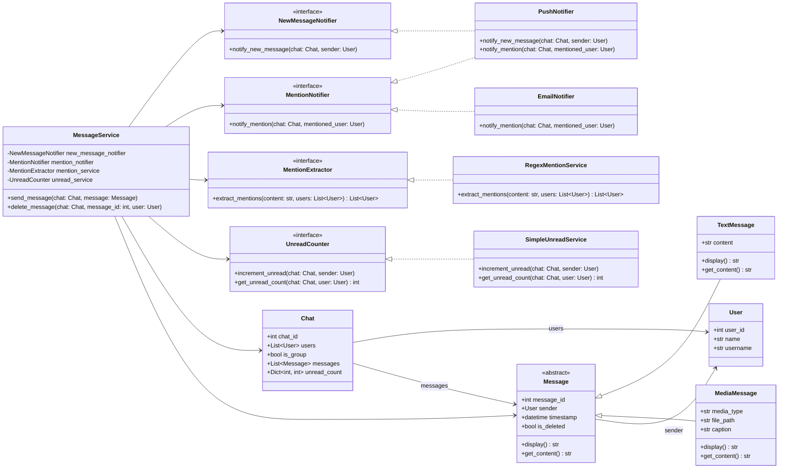

# Solid Principles 

## Introduction

In software development, crafting code that’s easy to maintain, scale, and tweak is the dream. The SOLID principles, introduced by Robert C. Martin (fondly called Uncle Bob), are five key object-oriented design principles that help developers write clean, robust, and flexible code.

In this tutorial, we’ll create a simplified WhatsApp chat system in Python, starting with a basic, non-SOLID implementation. Step by step, we’ll refactor the code, applying each SOLID principle, while pointing out the design’s weak spots and how each principle fixes them.

By the end, you’ll see how SOLID principles turn a brittle, hard-to-manage codebase into a modular, extensible, and testable system. Let’s get started!


## But what the fuck are exactly SOLID Principles?

Think of your codebase as a house. Without some ground rules, it turns into a fucking mess—hard to fix, impossible to add onto. **SOLID** is five principles that keep your code from becoming a shitshow. They’re your blueprint for writing software that doesn’t make you want to chuck your laptop out the window.

Here’s the breakdown:

| **Acronym** | **Principle** | **Description** |
|-------------|---------------|-----------------|
| **S** | Single Responsibility Principle (SRP) | A class should have one damn job. If it’s juggling multiple tasks, it’ll break when one changes. Keep it focused to avoid a maintenance hell. |
| **O** | Open/Closed Principle (OCP) | Code should be open to new features but sealed tight against tweaks to existing logic. Extend it without ripping the guts out. |
| **L** | Liskov Substitution Principle (LSP) | Subclasses should act like their parent class, no weird surprises. Swap them in without fucking up the system. |
| **I** | Interface Segregation Principle (ISP) | Don’t shove a bloated interface down a client’s throat. Give them only what they need, nothing more. |
| **D** | Dependency Inversion Principle (DIP) | Big-picture code shouldn’t depend on low-level details. Both should lean on abstractions to stay flexible and avoid a dependency nightmare. |

### Technical Depth
- **SRP**: A class with one responsibility (e.g., sending messages) is easier to test and change than one handling messages, notifications, and database saves. In our WhatsApp system, a `ChatManager` doing everything violates SRP, leading to fragile code where a change in notification logic could break message sending.
- **OCP**: By allowing extensions (e.g., new message types like voice notes) through inheritance or composition, but preventing changes to core logic, you avoid regressions. For WhatsApp, adding a new message type shouldn’t mean rewriting the message sender.
- **LSP**: If a `MediaMessage` subclass can’t be used wherever a `Message` base class is expected (e.g., it throws unexpected errors), it breaks LSP. This ensures polymorphism works smoothly in our chat system’s message handling.
- **ISP**: Forcing a client to implement unused methods (e.g., a `TextMessage` handling media-specific logic) creates clutter. In WhatsApp, separate interfaces for text and media messages keep classes lean.
- **DIP**: High-level modules (e.g., message sending logic) shouldn’t rely on concrete database or notification classes. Using abstractions (e.g., a `Storage` interface) in our WhatsApp system decouples components, making swaps (like changing databases) painless.

We’ll dig into each principle with our WhatsApp-like chat system, starting with a messy implementation and refactoring it into something that doesn’t suck.

### Real-World Application: WhatsApp Chat System

Imagine we’re coding a simplified version of WhatsApp’s messaging system. It’s got all the bells and whistles you’d expect (well, the important ones, anyway):

- Users can send text messages or media messages (like images or videos).
- Senders can delete their messages—poof, gone!
- Messages can mention users with a cheeky `@username`.
- Group chats and one-on-one chats are both supported.
- Unread message counts are tracked for each user.
- Notifications pop up when a message arrives or someone gets mentioned.
- Media messages come with special handling, like size limits and thumbnails.

We’ll kick things off with a basic, non-SOLID implementation that might feel a bit like duct-taping a spaceship together. Then, we’ll refactor it step by step, using each SOLID principle to turn it into a sleek, maintainable system that won’t make future-you cry.

## Initial Basic Implementation
Here's a simple, non-SOLID version of the WhatsApp chat system:


<br>


```python
# whatsapp_basic.py

from datetime import datetime
from typing import List, Dict, Optional

class User:
    def __init__(self, user_id: int, name: str, username: str):
        self.user_id = user_id
        self.name = name
        self.username = username

class Message:
    def __init__(self, message_id: int, sender: User, content: str, timestamp: datetime):
        self.message_id = message_id
        self.sender = sender
        self.content = content
        self.timestamp = timestamp
        self.is_deleted = False

class Chat:
    def __init__(self, chat_id: int, users: List[User], is_group: bool = False):
        self.chat_id = chat_id
        self.users = users
        self.is_group = is_group
        self.messages: List[Message] = []
        self.unread_count: Dict[int, int] = {user.user_id: 0 for user in users}

    def send_message(self, sender: User, content: str):
        message = Message(len(self.messages) + 1, sender, content, datetime.now())
        self.messages.append(message)
        self.notify_users(sender, content)
        self.increment_unread(sender)

    def delete_message(self, message_id: int, user: User):
        for msg in self.messages:
            if msg.message_id == message_id and msg.sender == user:
                msg.is_deleted = True
                print(f"Message {message_id} deleted by {user.username}")
                return
        print("Message not found or unauthorized")

    def notify_users(self, sender: User, content: str):
        mentioned_users = [user for user in self.users if f"@{user.username}" in content]
        for user in self.users:
            if user != sender:
                if user in mentioned_users:
                    print(f"NOTIFICATION: {user.username}, you were mentioned in chat {self.chat_id}")
                else:
                    print(f"NOTIFICATION: New message in chat {self.chat_id}")

    def increment_unread(self, sender: User):
        for user in self.users:
            if user != sender:
                self.unread_count[user.user_id] += 1

    def get_unread_count(self, user: User) -> int:
        return self.unread_count.get(user.user_id, 0)

    def display_chat(self):
        print(f"\n--- Chat {self.chat_id} ---")
        for msg in self.messages:
            if not msg.is_deleted:
                print(f"[{msg.timestamp.strftime('%H:%M')}] {msg.sender.username}: {msg.content}")
            else:
                print(f"[{msg.timestamp.strftime('%H:%M')}] [Deleted]")
```


### Usage Example:

<br>

```python
# Create users
alice = User(1, "Alice", "alice")
bob = User(2, "Bob", "bob")
charlie = User(3, "Charlie", "charlie")

# Individual chat
chat1 = Chat(1, [alice, bob])
chat1.send_message(alice, "Hi Bob!")
chat1.send_message(bob, "Hey @alice, how are you?")
chat1.send_message(alice, "I'm good! Sending a photo...")  # Simulated media
chat1.delete_message(1, alice)
print(f"Unread count for Bob: {chat1.get_unread_count(bob)}")

# Group chat
group_chat = Chat(2, [alice, bob, charlie], is_group=True)
group_chat.send_message(alice, "Hi everyone! @bob, check this out.")
group_chat.display_chat()
```

## Problems in the Initial Design: Why This Code Is a Hot Mess

Sure, the code *works*, but it’s like a car held together with duct tape—one wrong move and the whole thing falls apart. Let’s break down the shitshow that is our initial WhatsApp-like chat system design and why it’s begging for a SOLID makeover.

### 1. Single Responsibility Principle (SRP): This Class Is Doing Way Too Much
The `Chat` class is a fucking overachiever, juggling:
- Sending messages.
- Deleting messages.
- Handling notifications.
- Tracking unread counts.
- Detecting mentions.

**Problem**: That’s too many damn jobs for one class. It’s a nightmare to maintain, test, or extend. Change one thing (like notification logic), and you risk screwing up everything else. It’s like asking one intern to run the entire company.

**Technical Depth**: A class with multiple responsibilities violates SRP, leading to high coupling and fragility. For example, tweaking mention detection could accidentally break message deletion. Each responsibility (message sending, storage, notifications) should be split into separate classes to isolate changes and simplify testing.

### 2. Open/Closed Principle (OCP): Stop Ripping the Code Apart
Want to add media messages like images or videos? Good luck—you’ll need to gut the `Message` and `Chat` classes. New notification types like email or push? Same deal, you’re rewriting `notify_users`.

**Problem**: The code isn’t open for extension or closed for modification. Every new feature means hacking the existing logic, which is a recipe for bugs and swearing at 2 a.m.

**Technical Depth**: OCP requires designing classes to allow new functionality (e.g., new message types) via inheritance or composition without altering core logic. In our chat system, adding a `VideoMessage` should just extend `Message`, not force a rewrite of `Chat`’s sending logic.

### 3. Liskov Substitution Principle (LSP): Subclasses Acting Like Rebels
If you make a `MediaMessage` subclass, it might not play nice as a `Message`. For instance, its `content` could be a file path instead of text, breaking anything expecting a standard message.

**Problem**: Subtypes that don’t behave like their base type fuck up the system’s expectations. You swap in a `MediaMessage`, and suddenly everything crashes.

**Technical Depth**: LSP ensures subclasses can replace their base class without changing behavior. In our system, `MediaMessage` must handle all `Message` operations (like sending or saving) consistently, or polymorphism fails, leading to runtime errors or special-case handling.

## 4. Interface Segregation Principle (ISP): Don’t Force Shit on Clients
If we pull out a `Notifier` interface, it might include `mention_notification()` and `new_message_notification()`. But not every notifier (e.g., a simple SMS service) needs both.

**Problem**: Forcing classes to implement methods they don’t use is a pain in the ass and bloats the codebase with useless code.

**Technical Depth**: ISP demands tailored interfaces. In the WhatsApp system, a `Notifier` interface should split into `MessageNotifier` and `MentionNotifier` so clients (like an email notifier) only implement what they need, reducing complexity and empty method stubs.

### 5. Dependency Inversion Principle (DIP): Tangled Dependencies Suck
The `Chat` class is hardwired to specific notification logic, like calling a concrete `EmailNotifier` or `PushNotifier`.

**Problem**: This tight coupling makes swapping notification systems a fucking chore. Want to switch to a new database or notifier? Get ready to rewrite half the class.

**Technical Depth**: DIP says high-level modules (like `Chat`) shouldn’t depend on low-level ones (like `EmailNotifier`). Both should rely on abstractions (e.g., a `NotificationService` interface). This decoupling lets you swap implementations (e.g., from email to SMS) without touching `Chat`.

### Let’s Fix This Shit
We’ll refactor this mess step by step, applying each SOLID principle to turn this fragile codebase into something that doesn’t make you want to rage-quit programming.

## Applying SOLID Principles Incrementally:

## 1. Single Responsibility Principle (SRP): Stop Making Your Classes Work Overtime

#### `"A class should have only one reason to change. "`

The **Single Responsibility Principle** says a class should have one damn job. One reason to change. Not five. If your class is handling everything but the kitchen sink, you’re setting yourself up for a maintenance shitstorm.

#### Problem
Our `Chat` class is a fucking multitasker, trying to do it all:
- Sending and deleting messages.
- Firing off notifications.
- Tracking unread message counts.
- Spotting `@mentions` in messages.

This is like asking one person to cook, serve, clean, and manage the restaurant’s social media. Good luck fixing one part without breaking the rest. It’s a pain to test, extend, or even understand without a stiff drink.

**Technical Depth**: When a class juggles multiple responsibilities, it’s tightly coupled and fragile. A change to notification logic (e.g., adding SMS support) could mess up message sending or unread tracking. This violates SRP, making the codebase hard to maintain and test. Each responsibility—messaging, notifications, unread counts, mentions—represents a distinct axis of change that should live in its own class to reduce coupling and simplify updates.

#### Solution
Let’s break this mess into classes that each do one thing well:
- **MessageService**: Handles sending and deleting messages.
- **NotificationService**: Manages notifications for new messages or mentions.
- **UnreadService**: Tracks unread message counts for users.
- **MentionService**: Detects and processes `@mentions`.

**Refactored Code**:
Here’s how we split the `Chat` class’s duties:

<br>

```python
# whatsapp_srp.py

from abc import ABC, abstractmethod
from datetime import datetime
from typing import List, Dict, Optional

class User:
    def __init__(self, user_id: int, name: str, username: str):
        self.user_id = user_id
        self.name = name
        self.username = username

class Message:
    def __init__(self, message_id: int, sender: User, content: str, timestamp: datetime):
        self.message_id = message_id
        self.sender = sender
        self.content = content
        self.timestamp = timestamp
        self.is_deleted = False

class Chat:
    def __init__(self, chat_id: int, users: List[User], is_group: bool = False):
        self.chat_id = chat_id
        self.users = users
        self.is_group = is_group
        self.messages: List[Message] = []
        self.unread_count: Dict[int, int] = {user.user_id: 0 for user in users}

class NotificationService:
    def notify_new_message(self, chat: Chat, sender: User):
        for user in chat.users:
            if user != sender:
                print(f"NOTIFICATION: New message in chat {chat.chat_id} for {user.username}")

    def notify_mention(self, chat: Chat, mentioned_user: User):
        print(f"NOTIFICATION: {mentioned_user.username}, you were mentioned in chat {chat.chat_id}")

class MentionService:
    def extract_mentions(self, content: str, users: List[User]) -> List[User]:
        mentioned = []
        for user in users:
            if f"@{user.username}" in content:
                mentioned.append(user)
        return mentioned

class UnreadService:
    def increment_unread(self, chat: Chat, sender: User):
        for user in chat.users:
            if user != sender:
                chat.unread_count[user.user_id] += 1

    def get_unread_count(self, chat: Chat, user: User) -> int:
        return chat.unread_count.get(user.user_id, 0)

class MessageService:
    def __init__(self, notification_service: NotificationService,
                 mention_service: MentionService,
                 unread_service: UnreadService):
        self.notification_service = notification_service
        self.mention_service = mention_service
        self.unread_service = unread_service

    def send_message(self, chat: Chat, sender: User, content: str):
        message = Message(len(chat.messages) + 1, sender, content, datetime.now())
        chat.messages.append(message)

        # Handle mentions
        mentioned_users = self.mention_service.extract_mentions(content, chat.users)
        for user in mentioned_users:
            self.notification_service.notify_mention(chat, user)

        # Notify others
        if not mentioned_users:
            self.notification_service.notify_new_message(chat, sender)

        # Update unread count
        self.unread_service.increment_unread(chat, sender)

    def delete_message(self, chat: Chat, message_id: int, user: User):
        for msg in chat.messages:
            if msg.message_id == message_id and msg.sender == user:
                msg.is_deleted = True
                print(f"Message {message_id} deleted by {user.username}")
                return
        print("Message not found or unauthorized")
```
### Usage Example:


<br>

```python
alice = User(1, "Alice", "alice")
bob = User(2, "Bob", "bob")

chat = Chat(1, [alice, bob])

# Inject services
notifier = NotificationService()
mentioner = MentionService()
unreader = UnreadService()
messenger = MessageService(notifier, mentioner, unreader)

messenger.send_message(chat, alice, "Hi @bob!")
messenger.send_message(chat, bob, "Hello!")
messenger.delete_message(chat, 1, alice)
print(f"Unread: {unreader.get_unread_count(chat, bob)}")
```

### After Applying SRP: What’s Better and What’s Still Screwed

### Improvements: Why This Isn’t Total Chaos Anymore
Splitting the `Chat` class into `MessageService`, `NotificationService`, `UnreadService`, and `MentionService` was like telling an overworked employee to chill and focus on one damn thing. Here’s why it’s a win:

- **Each class has one job**: `MessageService` sends and deletes messages, `NotificationService` handles alerts, `UnreadService` tracks unread counts, and `MentionService` deals with mentions. No more classes trying to be the hero of every fucking task.
- **Easier to test and tweak**: Want to change how mentions work? Just touch `MentionService`. Need to test unread counts? `UnreadService` is small and mockable. No more wading through a 200-line class to figure out what’s breaking.

**Technical Depth**: By adhering to SRP, we’ve reduced coupling and increased cohesion. Each class now aligns with a single axis of change, making maintenance simpler. For example, updating notification logic only affects `NotificationService`, not message sending. Testing is streamlined since each class has a narrow scope, reducing the need for complex test setups. In our WhatsApp system, this modularity means adding a new feature (like group chat support) won’t require rewriting unrelated logic.

### Remaining Problems: Shit We Still Need to Fix
Don’t pop the champagne yet—this code still has issues that’ll bite us in the ass:

- **Adding media messages is a pain (OCP violation)**: Want to support images or videos? You’ll need to hack `MessageService` to handle new message types, which is the opposite of extensible. It’s like rebuilding your house every time you want a new room.
- **Notification logic is rigid as hell**: `NotificationService` is hardwired to its current alerting system. Adding new notification types (like email or SMS) means ripping it apart, which is a fucking chore.

**Technical Depth**: The Open/Closed Principle (OCP) is violated because `MessageService` isn’t designed to extend for new message types (e.g., `MediaMessage`) without modifying its core logic. This risks introducing bugs and regressions in the WhatsApp system, as changes to support video messages could break text message handling. Similarly, `NotificationService`’s concrete implementation lacks an abstraction layer, making it hard to plug in new notification methods (e.g., push or email) without altering its code, further violating OCP and hinting at a Dependency Inversion Principle (DIP) issue we’ll tackle later.

## 2. Open/Closed Principle (OCP): Extend, Don’t Fucking Rewrite
#### `"Open for extension, closed for modification."`

The **Open/Closed Principle** says your code should be open for new shit (like adding features) but closed to screwing with existing logic. Basically, you should be able to add new functionality without tearing the codebase apart like a bad renovation job.

#### Problem
Our WhatsApp-like system needs to handle:
- `TextMessage`
- `ImageMessage`
- `VideoMessage`

Right now, `Message` is a single, sad class, and `MessageService` is hardwired to deal with it. Want to add media messages like images or videos? You’re stuck hacking `MessageService`’s `send_message` method, adding if-else bullshit to handle each new type. That’s a fucking maintenance nightmare and practically begs for bugs.

**Technical Depth**: Modifying `MessageService` for every new message type violates OCP because the class isn’t closed to modification. Each change (e.g., adding `VideoMessage`) risks breaking existing logic for `TextMessage`. In our chat system, this makes scaling to new message types (like voice notes or GIFs) fragile and error-prone, as `MessageService`’s core logic must be rewritten, potentially introducing regressions.

#### Solution
Let’s make this extensible with inheritance and polymorphism. Define a `Message` base class (or abstract class) and let `TextMessage`, `ImageMessage`, and `VideoMessage` extend it. `MessageService` can then work with any `Message` type without giving a damn about the specifics.

**Refactored Code**:
Here’s how we refactor to make `MessageService` OCP-compliant:


<br>

```python
# whatsapp_ocp.py (extends srp)

from abc import ABC, abstractmethod

class Message(ABC):
    def __init__(self, message_id: int, sender: User, timestamp: datetime):
        self.message_id = message_id
        self.sender = sender
        self.timestamp = timestamp
        self.is_deleted = False

    @abstractmethod
    def display(self) -> str:
        pass

class TextMessage(Message):
    def __init__(self, message_id: int, sender: User, content: str, timestamp: datetime):
        super().__init__(message_id, sender, timestamp)
        self.content = content

    def display(self) -> str:
        return self.content

class MediaMessage(Message):
    def __init__(self, message_id: int, sender: User, media_type: str, file_path: str, thumbnail: str, timestamp: datetime):
        super().__init__(message_id, sender, timestamp)
        self.media_type = media_type  # "image", "video"
        self.file_path = file_path
        self.thumbnail = thumbnail

    def display(self) -> str:
        return f"[{self.media_type.upper()}] {self.thumbnail}"

# Update MessageService to handle any Message type
class MessageService:
    def __init__(self, notification_service: NotificationService,
                 mention_service: MentionService,
                 unread_service: UnreadService):
        self.notification_service = notification_service
        self.mention_service = mention_service
        self.unread_service = unread_service

    def send_message(self, chat: Chat, message: Message):
        chat.messages.append(message)

        # Extract content for mention detection (only for TextMessage)
        content = message.content if isinstance(message, TextMessage) else ""
        mentioned_users = self.mention_service.extract_mentions(content, chat.users)

        for user in mentioned_users:
            self.notification_service.notify_mention(chat, user)

        if not mentioned_users:
            self.notification_service.notify_new_message(chat, message.sender)

        self.unread_service.increment_unread(chat, message.sender)

    def delete_message(self, chat: Chat, message_id: int, user: User):
        for msg in chat.messages:
            if msg.message_id == message_id and msg.sender == user:
                msg.is_deleted = True
                print(f"Message {message_id} deleted by {user.username}")
                return
        print("Message not found or unauthorized")
```

### Usage with Media:

<br>

```python
alice = User(1, "Alice", "alice")
bob = User(2, "Bob", "bob")
chat = Chat(1, [alice, bob])

notifier = NotificationService()
mentioner = MentionService()
unreader = UnreadService()
messenger = MessageService(notifier, mentioner, unreader)

# Send text
text_msg = TextMessage(1, alice, "Hi @bob!", datetime.now())
messenger.send_message(chat, text_msg)

# Send image
image_msg = MediaMessage(2, bob, "image", "/photos/1.jpg", "IMG_001.jpg", datetime.now())
messenger.send_message(chat, image_msg)

# Display chat
for msg in chat.messages:
    if not msg.is_deleted:
        print(f"{msg.sender.username}: {msg.display()}")
```

### After Applying OCP: What’s Better and What Still Sucks

### Improvements: Less Pain, More Gain
Making `MessageService` follow the Open/Closed Principle has saved us from some serious headaches. Here’s why it’s not a total shitshow anymore:

- **Add new message types without messing with `MessageService`**: Want a `VoiceMessage` or `StickerMessage`? Just whip up a new `Message` subclass with its own `validate` and `save` methods. `MessageService` stays untouched, like a chill boss who doesn’t care about the details.
- **Extensible as hell**: The abstract `Message` class and polymorphism let you pile on new message types without breaking a sweat. It’s like a Lego set—you just snap on new pieces.

**Technical Depth**: By adhering to OCP, `MessageService` is closed to modification but open to extension through inheritance. New message types (e.g., `ImageMessage`, `VideoMessage`) are added as subclasses without changing `MessageService`’s `send_message` logic, minimizing the risk of bugs. In our WhatsApp system, this means you can introduce a `GIFMessage` without screwing up `TextMessage` handling, keeping the design scalable and maintainable.

### Remaining Problems: Shit We Haven’t Fixed Yet
We’re not popping champagne just yet—the code still has some annoying quirks:

- **Media messages break mention detection**: `ImageMessage` and `VideoMessage` store `content` as a file path (like `/images/dog.jpg`), so `MentionService` chokes when it tries to find `@mentions` in that. Spoiler: there are no mentions in a damn file path.
- **Subclasses might not behave (LSP violation)**: If `MediaMessage` doesn’t act like a proper `Message` (e.g., it handles `save` or notifications differently), swapping it in could fuck up the system’s expectations.

**Technical Depth**: The mention detection issue stems from `MentionService` assuming all `Message` types have text-based `content` suitable for `@mentions`. For `MediaMessage`, where `content` is a file path, this causes errors, highlighting a design flaw. The Liskov Substitution Principle (LSP) is violated if `MediaMessage` isn’t fully substitutable for `Message`—for instance, if it skips expected behaviors or throws unexpected errors. In our WhatsApp system, this risks runtime issues in `MessageService` or `MentionService`, requiring special-case handling that complicates the code.

## 3. Liskov Substitution Principle (LSP): Don’t Let Subclasses Screw Things Up
#### `"Subtypes must be substitutable for their base types."`

The **Liskov Substitution Principle** says you should be able to swap any subclass for its base class without the system losing its shit. If you plug in a `MediaMessage` where a `Message` is expected, it better behave, or you’re in for a bad time.

#### Problem
Our `Message` subclasses are causing trouble:
- `TextMessage` has `content` as a string, perfect for spotting `@mentions` like a pro.
- `MediaMessage` (like `ImageMessage` or `VideoMessage`) uses `content` as a file path (e.g., `/videos/clip.mp4`), so `MentionService`’s `check_mentions` method chokes when it tries to parse that for mentions. Spoiler: file paths don’t have `@mentions`, and the code breaks like a cheap toy.

This violates LSP because `MediaMessage` isn’t properly substitutable for `Message`. It’s like promising a burger but serving a shoe.

**Technical Depth**: LSP requires that subclasses honor the base class’s contract, ensuring consistent behavior across all operations. In our WhatsApp system, `MentionService` expects `Message`’s `content` to be text for mention detection, but `MediaMessage`’s file-path `content` causes errors or invalid results. This breaks polymorphism, as `MessageService` can’t reliably process all `Message` types without special handling, leading to fragile code and potential runtime crashes.

#### Solution
Add a `get_content()` method to the `Message` base class, so every subclass can provide content suitable for mention detection. `TextMessage` returns its text, while `MediaMessage` returns an empty string (since it has no text to parse). This keeps `MentionService` happy and the system stable.

**Refactored Code**:
Here’s how we fix the `Message` hierarchy and `MentionService`:


<br>

```python
# whatsapp_lsp.py

class Message(ABC):
    def __init__(self, message_id: int, sender: User, timestamp: datetime):
        self.message_id = message_id
        self.sender = sender
        self.timestamp = timestamp
        self.is_deleted = False

    @abstractmethod
    def display(self) -> str:
        pass

    @abstractmethod
    def get_content(self) -> str:
        """Return searchable content for mentions, filtering, etc."""
        pass

class TextMessage(Message):
    def __init__(self, message_id: int, sender: User, content: str, timestamp: datetime):
        super().__init__(message_id, sender, timestamp)
        self.content = content

    def display(self) -> str:
        return self.content

    def get_content(self) -> str:
        return self.content

class MediaMessage(Message):
    def __init__(self, message_id: int, sender: User, media_type: str, file_path: str, caption: str, timestamp: datetime):
        super().__init__(message_id, sender, timestamp)
        self.media_type = media_type
        self.file_path = file_path
        self.caption = caption  # Optional caption

    def display(self) -> str:
        cap = f" (Caption: {self.caption})" if self.caption else ""
        return f"[{self.media_type.upper()}]{cap}"

    def get_content(self) -> str:
        return self.caption or ""  # Caption can contain mentions
```
### Update Message Service
<br>

```python
def send_message(self, chat: Chat, message: Message):
    chat.messages.append(message)
    content = message.get_content()  # Now works for all messages
    mentioned_users = self.mention_service.extract_mentions(content, chat.users)
    # ... rest unchanged
```
## After Applying LSP: What’s Fixed and What’s Still a Problem

### Improvements: Subclasses Aren’t Fucking Up Anymore
Adding the `get_content()` method to our `Message` class has made our WhatsApp system way less likely to throw a tantrum. Here’s why it’s a win:

- **MediaMessage behaves like a proper `Message`**: `ImageMessage` and `VideoMessage` now play nice, returning an empty string from `get_content()` instead of serving up file paths that break shit. They fit seamlessly where a `Message` is expected.
- **No runtime errors with `get_content()`**: `MentionService` can call `get_content()` on any `Message` type without crashing. Whether it’s a `TextMessage` or a `VideoMessage`, the system keeps humming along.

**Technical Depth**: LSP compliance means all `Message` subclasses are fully substitutable for the base `Message` class. The `get_content()` method ensures `MentionService` gets consistent, text-based content (or an empty string for media), eliminating errors when processing `MediaMessage` objects. In our WhatsApp system, this guarantees `MessageService` and `MentionService` can handle any message type polymorphically, improving reliability and reducing the need for hacky workarounds.

### Remaining Problems: Shit We Still Need to Sort Out
We’re getting there, but the codebase still has some annoying crap to fix:

- **NotificationService is a bloated mess (ISP violation)**: It’s handling both regular notifications and mention notifications in one class. If you want an SMS notifier that doesn’t deal with mentions, you’re stuck implementing useless methods. That’s a pain in the ass.
- **Concrete dependencies are screwing us (DIP violation)**: `MessageService` is hardwired to specific classes like `NotificationService` and `DatabaseService`. Want to swap to a new database or notification system? Good luck rewriting half the damn code.

**Technical Depth**: The Interface Segregation Principle (ISP) is violated because `NotificationService` forces clients to handle both `notify` (for new messages) and mention-related logic, even if they only need one. This leads to bloated implementations and unnecessary complexity in our WhatsApp system. The Dependency Inversion Principle (DIP) is also violated, as high-level modules like `MessageService` depend on concrete classes instead of abstractions, making it hard to swap out implementations (e.g., switching from a SQL database to MongoDB) without modifying code. These issues limit flexibility and make extending the system a chore.

## 4. Interface Segregation Principle (ISP): Don’t Shove Useless Shit on Clients
#### `"Clients should not depend on interfaces they don't use."`

The **Interface Segregation Principle** says don’t force classes to deal with methods they don’t give a damn about. If your interface is a bloated mess, you’re making life harder than it needs to be, like handing someone a 50-page manual for a toaster.

#### Problem
We want different notifiers for our WhatsApp system:
- `PushNotifier` (for app alerts)
- `EmailNotifier` (for email blasts)
- `SMSNotifier` (for text messages)

But our `NotificationService` is a one-size-fits-all deal, expecting every notifier to handle both `notify_new_message()` (for new messages) and `notify_mention()` (for `@mentions`). Problem is, not every notifier needs both. An `SMSNotifier` might only send new message alerts, so forcing it to implement `notify_mention()` is a fucking waste of code and brainpower.

**Technical Depth**: A single, fat interface like `NotificationService` violates ISP by requiring clients to implement methods they don’t use. This leads to empty or throwaway implementations (e.g., an `SMSNotifier` with a dummy `notify_mention()`), increasing complexity and maintenance overhead. In our WhatsApp system, this bloated interface makes adding new notifiers cumbersome and error-prone, as clients must conform to irrelevant methods, cluttering the codebase.

#### Solution
Break `NotificationService` into smaller, focused interfaces: one for new message notifications and one for mention notifications. Notifiers only implement what they actually need, keeping things lean and mean.

**Refactored Code**:
Here’s how we split the notification logic into separate interfaces:


<br>

```python
# whatsapp_isp.py

class NewMessageNotifier(ABC):
    @abstractmethod
    def notify_new_message(self, chat: Chat, sender: User):
        pass

class MentionNotifier(ABC):
    @abstractmethod
    def notify_mention(self, chat: Chat, mentioned_user: User):
        pass

class PushNotifier(NewMessageNotifier, MentionNotifier):
    def notify_new_message(self, chat: Chat, sender: User):
        print(f"📱 Push: New message in chat {chat.chat_id}")

    def notify_mention(self, chat: Chat, mentioned_user: User):
        print(f"📱 Push: {mentioned_user.username}, you were mentioned!")

class EmailNotifier(MentionNotifier):  # Only cares about mentions
    def notify_mention(self, chat: Chat, mentioned_user: User):
        print(f"📧 Email: {mentioned_user.username}, you were mentioned in chat {chat.chat_id}")

# Update MessageService to accept multiple notifiers
class MessageService:
    def __init__(self,
                 new_message_notifier: Optional[NewMessageNotifier],
                 mention_notifier: Optional[MentionNotifier],
                 mention_service: MentionService,
                 unread_service: UnreadService):
        self.new_message_notifier = new_message_notifier
        self.mention_notifier = mention_notifier
        self.mention_service = mention_service
        self.unread_service = unread_service

    def send_message(self, chat: Chat, message: Message):
        chat.messages.append(message)
        content = message.get_content()
        mentioned_users = self.mention_service.extract_mentions(content, chat.users)

        for user in mentioned_users:
            if self.mention_notifier:
                self.mention_notifier.notify_mention(chat, user)

        if not mentioned_users and self.new_message_notifier:
            self.new_message_notifier.notify_new_message(chat, message.sender)

        self.unread_service.increment_unread(chat, message.sender)
```

### Usage Example: 
<br>

```python
push = PushNotifier()
email = EmailNotifier()

# Can mix and match
messenger1 = MessageService(push, push, mentioner, unreader)      # Push for all
messenger2 = MessageService(None, email, mentioner, unreader)    # Email only for mentions
```
## After Applying ISP: What’s Cleaner and What’s Still a Drag

### Improvements: No More Useless Code Bullshit
Splitting `NotificationService` into `MessageNotifier` and `MentionNotifier` interfaces has made our WhatsApp system way less annoying to work with. Here’s why it’s a step up:

- **No forced implementation of useless methods**: `SMSNotifier` and `EmailNotifier` only implement `notify_new_message()`, while `PushNotifier` can handle both message and mention notifications if needed. No more writing empty `notify_mention()` stubs just to make the compiler shut up.
- **Flexible notifier composition**: Mix and match notifiers like a pro. Want SMS for messages and push for mentions? Easy. The system’s ready for whatever combo you throw at it without breaking a damn sweat.

**Technical Depth**: ISP compliance ensures notifiers only implement the interfaces they actually use, reducing code bloat and simplifying maintenance. In our WhatsApp system, `SMSNotifier` skips `notify_mention()` without issue, and `NotificationService` delegates to the appropriate interface (`MessageNotifier` or `MentionNotifier`). This makes adding new notifiers (e.g., `SlackNotifier`) straightforward, as they only take on relevant methods, improving modularity and testability.

### Remaining Problems: Shit We Still Need to Fix
We’re almost there, but one big issue is still fucking with us:

- **Concrete dependencies are a pain in the ass (DIP violation)**: `MessageService`, `TextMessage`, and others are hardwired to specific classes like `NotificationService`, `DatabaseService`, and `PushNotifier`. Want to swap to a MongoDB database or a different notification system? You’re stuck rewriting half the damn code.

**Technical Depth**: The Dependency Inversion Principle (DIP) is violated because high-level modules (e.g., `MessageService`) depend on concrete implementations instead of abstractions. This tight coupling makes it hard to swap out components (e.g., changing from a SQL `DatabaseService` to a cloud-based one) without modifying multiple classes. In our WhatsApp system, this limits flexibility, especially for scaling to new storage or notification systems, and increases maintenance effort when integrating new services.

## 5. Dependency Inversion Principle (DIP): Stop Clinging to Concrete Shit
#### `"Depend on abstractions, not concretions."`

The **Dependency Inversion Principle** says don’t tie your code to specific implementations like a needy ex. High-level modules (like `MessageService`) should depend on abstractions, not hardwired classes. This keeps your code flexible and saves you from a fucking headache when things change.

#### Problem
Our `MessageService` and `Message` subclasses are glued to concrete services like `UnreadService`, `MentionService`, and `NotificationService`. Want to swap `DatabaseService` for a MongoDB version or mock it for testing? Tough luck—you’re stuck rewriting code or dealing with a testing nightmare. It’s like building a house with nails you can’t pull out.

**Technical Depth**: DIP requires that high-level modules (e.g., `MessageService`) and low-level modules (e.g., `DatabaseService`) both depend on abstractions, not concrete implementations. Currently, our WhatsApp system’s tight coupling to concrete classes makes it hard to swap services (e.g., from SQL to cloud storage) or mock them for unit tests. This increases maintenance effort and reduces flexibility, as changes to one service ripple through the codebase, risking bugs.

#### Solution
Define interfaces for all services (`DatabaseService`, `UnreadService`, `MentionService`, etc.) and make `MessageService` and `Message` subclasses depend on those abstractions. This way, you can plug in different implementations or mocks without touching the core logic.

**Refactored Code**:
Here’s how we abstract the services with interfaces:


<br>

```python
# whatsapp_dip.py

from abc import ABC, abstractmethod

# --- Interfaces ---
class UnreadCounter(ABC):
    @abstractmethod
    def increment_unread(self, chat: Chat, sender: User):
        pass

    @abstractmethod
    def get_unread_count(self, chat: Chat, user: User) -> int:
        pass

class MentionExtractor(ABC):
    @abstractmethod
    def extract_mentions(self, content: str, users: List[User]) -> List[User]:
        pass

# --- Implementations ---
class SimpleUnreadService(UnreadCounter):
    def increment_unread(self, chat: Chat, sender: User):
        for user in chat.users:
            if user != sender:
                chat.unread_count[user.user_id] = chat.unread_count.get(user.user_id, 0) + 1

    def get_unread_count(self, chat: Chat, user: User) -> int:
        return chat.unread_count.get(user.user_id, 0)

class RegexMentionService(MentionExtractor):
    def extract_mentions(self, content: str, users: List[User]) -> List[User]:
        return [user for user in users if f"@{user.username}" in content]

# MessageService now depends on abstractions
class MessageService:
    def __init__(self,
                 new_message_notifier: Optional[NewMessageNotifier],
                 mention_notifier: Optional[MentionNotifier],
                 mention_service: MentionExtractor,
                 unread_service: UnreadCounter):
        self.new_message_notifier = new_message_notifier
        self.mention_notifier = mention_notifier
        self.mention_service = mention_service
        self.unread_service = unread_service

    def send_message(self, chat: Chat, message: Message):
        chat.messages.append(message)
        content = message.get_content()
        mentioned_users = self.mention_service.extract_mentions(content, chat.users)

        for user in mentioned_users:
            if self.mention_notifier:
                self.mention_notifier.notify_mention(chat, user)

        if not mentioned_users and self.new_message_notifier:
            self.new_message_notifier.notify_new_message(chat, message.sender)

        self.unread_service.increment_unread(chat, message.sender)

    def delete_message(self, chat: Chat, message_id: int, user: User):
        for msg in chat.messages:
            if msg.message_id == message_id and msg.sender == user:
                msg.is_deleted = True
                print(f"Message {message_id} deleted by {user.username}")
                return
        print("Message not found or unauthorized")
```

### Improvements: No More Dependency Hell
By making our WhatsApp system depend on abstractions instead of concrete classes, we’ve kicked a major pain in the ass to the curb. Here’s why it’s a big damn win:

- **All dependencies are abstractions**: `MessageService` and `Message` subclasses now lean on interfaces like `Database`, `UnreadCounter`, and `MessageNotifier`. No more clinging to specific implementations like a bad habit.
- **Easy to mock for testing**: Writing unit tests is now a breeze. Need to test `MessageService`? Just throw in a mock `Database` and you’re good. No fucking around with real services.
- **Swappable implementations**: Want to switch from a SQL `DatabaseService` to a `MongoDBDatabase` or try a new `UnreadService`? Plug it in without rewriting a single line of core logic.

**Technical Depth**: DIP compliance decouples high-level modules (`MessageService`, `Message`) from low-level implementations (`DatabaseService`, `NotificationService`) by using interfaces. This allows seamless swapping of services (e.g., replacing `DatabaseService` with a cloud-based `CloudStorage`) and simplifies mocking for unit tests. In our WhatsApp system, this flexibility means we can adapt to new storage or notification systems without touching the core codebase, boosting maintainability and scalability.

### Remaining Problems: Are We Done Yet?
With DIP in place, our codebase is looking pretty solid—no pun intended. Most of the major issues are squashed, but in a real-world system, you might still hit some bumps:
- **Real-world complexity**: Our simplified WhatsApp system doesn’t cover edge cases like network failures, retry logic, or group chat dynamics. These could require additional abstractions or error handling, but they’re not SOLID violations—just shit you’d need to plan for.
- **Performance tweaks**: If your system scales to millions of messages, you might need to optimize database access or notification delivery. That’s less about SOLID and more about not screwing yourself with inefficient implementations.

**Technical Depth**: The refactored code now adheres to all SOLID principles, making it modular, extensible, and testable. However, practical systems often face challenges outside SOLID’s scope, like handling concurrent message processing or integrating with external APIs. In our WhatsApp system, these might involve adding retry mechanisms for failed notifications or supporting group chats, which could be addressed with patterns like Factory or Strategy, but the SOLID foundation ensures the core design remains robust and adaptable.



### Final Refactored Code with all SOLID principles applied:
<br>

```python
# whatsapp_final.py

from abc import ABC, abstractmethod
from datetime import datetime
from typing import List, Dict, Optional

# === DOMAIN MODELS ===
class User:
    def __init__(self, user_id: int, name: str, username: str):
        self.user_id = user_id
        self.name = name
        self.username = username

class Chat:
    def __init__(self, chat_id: int, users: List[User], is_group: bool = False):
        self.chat_id = chat_id
        self.users = users
        self.is_group = is_group
        self.messages = []
        self.unread_count: Dict[int, int] = {user.user_id: 0 for user in users}

# === MESSAGES ===
class Message(ABC):
    def __init__(self, message_id: int, sender: User, timestamp: datetime):
        self.message_id = message_id
        self.sender = sender
        self.timestamp = timestamp
        self.is_deleted = False

    @abstractmethod
    def display(self) -> str:
        pass

    @abstractmethod
    def get_content(self) -> str:
        pass

class TextMessage(Message):
    def __init__(self, message_id: int, sender: User, content: str, timestamp: datetime):
        super().__init__(message_id, sender, timestamp)
        self.content = content

    def display(self) -> str:
        return self.content

    def get_content(self) -> str:
        return self.content

class MediaMessage(Message):
    def __init__(self, message_id: int, sender: User, media_type: str, file_path: str, caption: str, timestamp: datetime):
        super().__init__(message_id, sender, timestamp)
        self.media_type = media_type
        self.file_path = file_path
        self.caption = caption

    def display(self) -> str:
        cap = f" (Caption: {self.caption})" if self.caption else ""
        return f"[{self.media_type.upper()}]{cap}"

    def get_content(self) -> str:
        return self.caption or ""

# === INTERFACES ===
class NewMessageNotifier(ABC):
    @abstractmethod
    def notify_new_message(self, chat: Chat, sender: User):
        pass

class MentionNotifier(ABC):
    @abstractmethod
    def notify_mention(self, chat: Chat, mentioned_user: User):
        pass

class MentionExtractor(ABC):
    @abstractmethod
    def extract_mentions(self, content: str, users: List[User]) -> List[User]:
        pass

class UnreadCounter(ABC):
    @abstractmethod
    def increment_unread(self, chat: Chat, sender: User):
        pass

    @abstractmethod
    def get_unread_count(self, chat: Chat, user: User) -> int:
        pass

# === IMPLEMENTATIONS ===
class PushNotifier(NewMessageNotifier, MentionNotifier):
    def notify_new_message(self, chat: Chat, sender: User):
        print(f"📱 Push: New message in chat {chat.chat_id}")

    def notify_mention(self, chat: Chat, mentioned_user: User):
        print(f"📱 Push: {mentioned_user.username}, you were mentioned!")

class EmailNotifier(MentionNotifier):
    def notify_mention(self, chat: Chat, mentioned_user: User):
        print(f"📧 Email: {mentioned_user.username}, you were mentioned in chat {chat.chat_id}")

class RegexMentionService(MentionExtractor):
    def extract_mentions(self, content: str, users: List[User]) -> List[User]:
        return [user for user in users if f"@{user.username}" in content]

class SimpleUnreadService(UnreadCounter):
    def increment_unread(self, chat: Chat, sender: User):
        for user in chat.users:
            if user != sender:
                chat.unread_count[user.user_id] = chat.unread_count.get(user.user_id, 0) + 1

    def get_unread_count(self, chat: Chat, user: User) -> int:
        return chat.unread_count.get(user.user_id, 0)

# === CORE SERVICE ===
class MessageService:
    def __init__(self,
                 new_message_notifier: Optional[NewMessageNotifier],
                 mention_notifier: Optional[MentionNotifier],
                 mention_service: MentionExtractor,
                 unread_service: UnreadCounter):
        self.new_message_notifier = new_message_notifier
        self.mention_notifier = mention_notifier
        self.mention_service = mention_service
        self.unread_service = unread_service

    def send_message(self, chat: Chat, message: Message):
        chat.messages.append(message)
        content = message.get_content()
        mentioned_users = self.mention_service.extract_mentions(content, chat.users)

        for user in mentioned_users:
            if self.mention_notifier:
                self.mention_notifier.notify_mention(chat, user)

        if not mentioned_users and self.new_message_notifier:
            self.new_message_notifier.notify_new_message(chat, message.sender)

        self.unread_service.increment_unread(chat, message.sender)

    def delete_message(self, chat: Chat, message_id: int, user: User):
        for msg in chat.messages:
            if msg.message_id == message_id and msg.sender == user:
                msg.is_deleted = True
                print(f"Message {message_id} deleted by {user.username}")
                return
        print("Message not found or unauthorized")
```
## Summary and Key Takeaways: Why SOLID Kicks Ass

We took a shitty, monolithic WhatsApp-like chat system and turned it into a lean, mean, maintainable machine by applying SOLID principles one by one. Here’s the rundown of how each principle saved us from a coding hellhole:

| **Principle** | **Problem** | **Fix** |
|---------------|-------------|---------|
| **SRP** | Monolithic classes trying to do every damn thing | Split responsibilities into clean, focused classes (e.g., `MessageService`, `NotificationService`). |
| **OCP** | Having to rewrite code for every new feature | Add new message types (like `VideoMessage`) via extension, no fucking around with core logic. |
| **LSP** | Subclasses acting like rebellious teens, breaking behavior | Ensure safe polymorphism with consistent interfaces (e.g., `get_content()` for all `Message` types). |
| **ISP** | Fat interfaces forcing useless method implementations | Use lean, targeted contracts (e.g., `MessageNotifier`, `MentionNotifier`) so notifiers only do what they need. |
| **DIP** | Tight coupling to specific classes, making testing a pain in the ass | Depend on abstractions (e.g., `Database`, `UnreadCounter`) for testable, swappable components. |

### Conclusion: SOLID Ain’t Just Fancy Talk
We started with a WhatsApp system that was a fragile mess—one wrong move and it’d collapse like a bad Tinder date. By applying SOLID principles step by step, we crafted a modular, extensible design that doesn’t make you want to chuck your laptop out the window.

- **SOLID isn’t just theory**: These principles fix real-world shit, like making your growing app easier to manage without losing your mind.
- **Clean architecture, easier testing**: The refactored system is simpler to test, tweak, and scale, whether you’re adding new message types or swapping databases.
- **Guidelines, not gospel**: Use SOLID as a roadmap, not a rigid rulebook. Adapt it to your needs, but don’t ignore it unless you love pain.

This incremental refactoring approach shows how to evolve any system from a tangled nightmare to a robust, scalable beast. Good design isn’t about being perfect—it’s about making shit better, one step at a time.

Each SOLID principle addressed a specific flaw in our WhatsApp system. SRP broke up the monolithic `Chat` class, reducing coupling. OCP enabled new message types without modifying `MessageService`, ensuring extensibility. LSP guaranteed `MediaMessage` could replace `Message` without breaking `MentionService`. ISP streamlined notifications with focused interfaces, avoiding bloat. DIP decoupled services using abstractions, making testing and swapping (e.g., SQL to MongoDB) painless. Together, these principles transformed the system into a maintainable, testable architecture ready for real-world challenges like group chats or high-scale messaging.